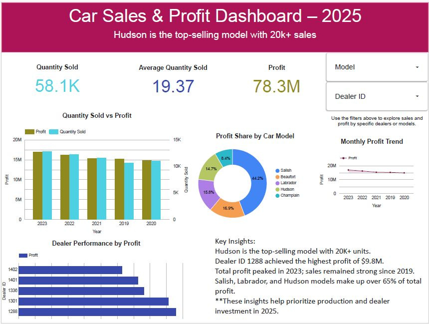

# Car Sales & Profit Dashboard – 2025

This project visualizes car sales and profit data from 2019–2023 using Google Looker Studio. It includes interactive filters, performance breakdown by model and dealer, and key KPIs. Here's the story the data tells:

##  Dashboard Preview

 [👉 Click here to view the live lookerstudio dashboard](https://lookerstudio.google.com/your-link-here)

---

###  The Business Question:
How can we optimize production and dealer investment in 2025 based on past sales and profit performance?

---

## Tools Used
- Looker Studio  
- Google Sheets

---

###  Key Findings:

- **Hudson** emerged as the top-selling model with over **20,000 units sold**, generating a significant portion of total profit.
- **Dealer 1288** achieved the **highest individual profit** of **$9.8M**, standing out as a strong performer.
- The **year 2023** marked a **peak in total profit**, indicating positive sales momentum post-COVID.
- Three models — **Salish**, **Labrador**, and **Hudson** — contributed to over **65% of total profit**, showing clear product concentration.
- Despite stable unit sales, **average quantity per dealer remained flat**, suggesting room to optimize regional distribution.

---

###  What This Means for Business:

These insights can help the company:

- **Prioritize the Hudson model** for production in 2025  
- **Allocate more resources** to high-performing dealers like 1288  
- Consider **phasing out or redesigning** underperforming models (e.g., Champlain)  
- **Refine sales strategies** in lower-performing regions by analyzing dealer-level data further

---

###  Dashboard Design Choices:

- **Bar charts** show the balance between profit and units sold over time  
- A **donut chart** highlights profit distribution by model — ideal for identifying top performers  
- A **dealer performance chart** helps management quickly identify who’s contributing the most  
- **Interactive filters** let users explore model or dealer-specific views without overwhelming them

---

###  Final Thoughts:

This dashboard doesn’t just show numbers — it **tells a story** about what’s working, what’s not, and where action can create the most value. It’s a tool for **strategic planning**, not just reporting.

