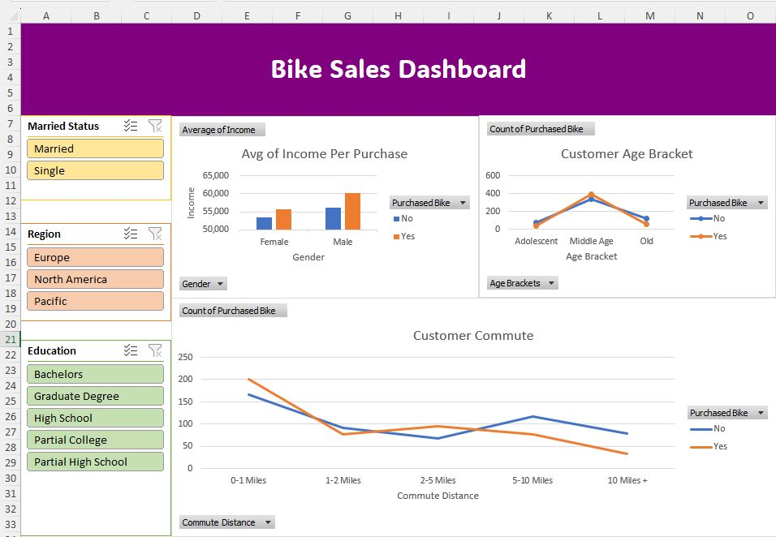

#  Excel Dashboard – Bike Sales Analysis

This dashboard was created in Excel to analyze factors that influence customer bike purchases. The interactive dashboard visualizes relationships between income, commute distance, education, and more — helping stakeholders understand customer behavior better.

---

##  Dashboard Preview

---

##  Business Goal

The company wanted to explore how customer demographics and lifestyle impact their decision to purchase a bike. The goal was to find key patterns to inform marketing and sales strategies.

---

##  What I Did

- Cleaned and analyzed the dataset in Excel
- Built pivot tables and pivot charts to summarize key trends
- Added slicers for dynamic filtering (e.g., by region, education, marital status)
- Visualized relationships between:
  - Average income and purchase behavior
  - Commute distance and bike ownership
  - Age groups and purchasing likelihood

---

##  Key Insights

- Males had higher average income and were more likely to purchase a bike
- Middle-aged customers showed the highest bike purchase rate
- Commute distance between **2–5 miles** was most common among buyers
- Customers with a **Bachelor's degree** were the top buyers

---

##  Tools Used

- Microsoft Excel  
- PivotTables  
- PivotCharts  
- Slicers & Conditional Formatting  
- Basic formulas (`IF`, `SUMIFS`, `AVERAGEIFS`)

---

##  Files

- `Excel Project Dataset.xlsx` – dataset, calculations, and dashboard  
- `Capture.JPG` – dashboard screenshot
