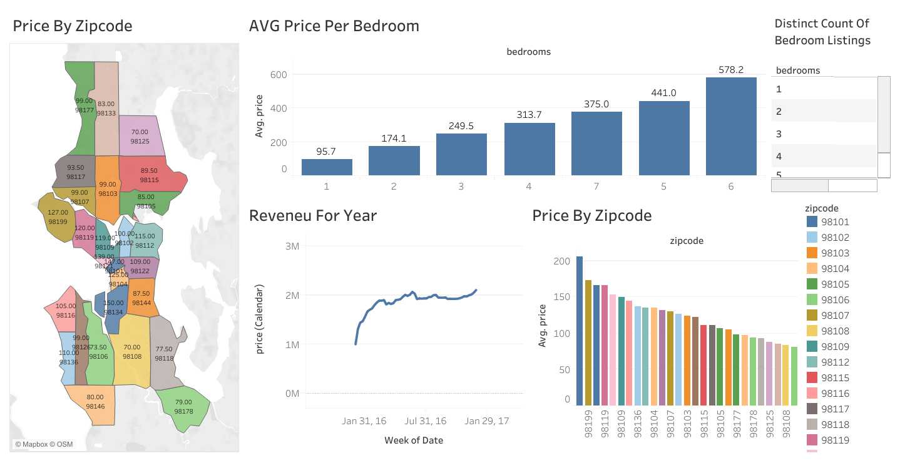

#  Tableau Dashboard – Airbnb Price & Revenue Insights

This dashboard was created in Tableau to analyze Airbnb pricing and revenue trends across Seattle. It helps identify how factors like bedroom count, location (zipcode), and time affect prices and revenue generation — providing hosts and analysts with valuable market insights.

---

##  Dashboard Preview

[🔗 Click here to view the live dashboard](https://public.tableau.com/app/profile/fahimeh.ghavi/viz/AirBnBFullProject_17444909114610/Dashboard1?publish=yes)

---

##  Business Goal

The goal was to help Airbnb hosts and stakeholders understand how different property features and locations influence price and revenue. By visualizing pricing trends and geographic differences, they can make data-driven decisions about listing strategies

---

##  What I Did

- Cleaned and prepared the dataset in Excel  
- Designed interactive dashboards in Tableau  
- Built visualizations including:  
  - Price per bedroom  
  - Revenue over time  
  - Zipcode-based geographic map  
  - Count of listings by bedrooms  

---

##  Key Insights

- Average price increases with the number of bedrooms — listings with 6 bedrooms are the most expensive  
- Zip codes like **98105**, **98115**, and **98102** have the highest average prices  
- Revenue peaked around mid-2016 and shows strong seasonal trends  
- Neighborhoods with higher density and prices may offer better ROI for hosts  

---

##  Tools Used

- Tableau Public  
- Microsoft Excel  
- Mapping, bar charts, line charts, filters, and tooltips  
